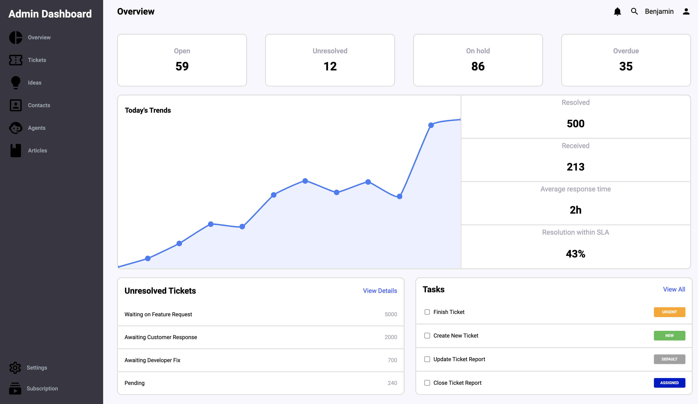

# odin-admin-dashboard

[Access here](https://benjamin-albarzendji.github.io/odin-admin-dashboard/)

### Description
#### This is just a project I did to deepen my skills in more advanced CSS such as with Grid (90% of the layout is done in Grid), Flexbox, selectors and pseudo classes. It was the first time using grid so it took some trial and error until I found a balance that could work. The project is not fully flexible. 
